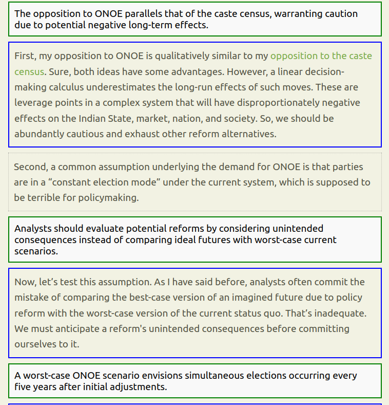

# Paragraph Summarizer Firefox Extension (ChatGPT-generated)

This is a Firefox extension that produces one-line summaries of each paragraph above the paragraph itself on any webpage: that way, you can read the summary and decide whether to skip to the next paragraph or read the paragraph in detail. Existing readers/summarizers give summaries of the entire article which I haven't found very useful.

To use this, you'll need an OpenAI API Key: so you need to set up a developer account, add a credit card, and load some money into your account. The monthly cost will be trivial, but it is not free. (Maybe someone can modify this code to use a free LLM?)

## ⚠️ Major Disclaimers ⚠️

1. **This is not good code**. It was written quickly, by ChatGPT o1-preview. I have no idea of Firefox extension development and I am not very good at JavaScript. The code is probably not well-structured, and certainly not battle tested. The only reason I'm putting this code here is for people to play with.
2. **There are no tests**, and I have no idea if this extension will break things or not. It’s just for playing around.
3. **Use at your own risk**. I make no claims about its suitability for any purpose.

## 🖥️ What This Does

This Firefox extension does two main things when you click its toolbar button:

1. Adds a blue box around each paragraph on the webpage.
2. If a paragraph has more than 200 characters, it summarizes that paragraph using OpenAI’s API and displays the summary in a green box above the paragraph. That way, I can read the summary and decide whether to skip to the next paragraph or read the paragraph in detail. 

Screeshot:

In the screenshot above, any paragraph with 200  or characters is outlined in blue color, and a summary of the paragraph is inserted just above it (green box). Shorter paragraphs are left as is.

## 🔧 INSTALLATION

Here’s how you can install and run this extension locally in Firefox:

1. **Download the code**:
    - Click the green **Code** button at the top of this GitHub page and choose **Download ZIP**.
    - Extract the ZIP file somewhere on your computer.

2. **Edit the `content.js`**:
    - Open the file `content.js` in a text editor (e.g., Notepad on Windows or TextEdit on Mac).
    - Find the placeholder line in the file that says `"YOUR_OPENAI_API_KEY"`. Replace that with your actual OpenAI API key. 
        - If you don’t know how to get an API key, you can ask ChatGPT, and it will explain how to get one from the OpenAI website.
    - It currently uses gpt-4o-mini, one of the cheapest models. The summaries won't be great. If you're OK with spending a little more money to get better summaries, change this to gpt-4o.

3. **Load the extension in Firefox**:
    - Open Firefox.
    - Type `about:debugging` in the address bar and press Enter.
    - Click on **"This Firefox"**.
    - Click on **"Load Temporary Add-on..."**.
    - In the file dialog, navigate to the folder where you downloaded and extracted this project, and select the `manifest.json` file.
    - The extension should now be loaded, and its icon will appear in your toolbar. (If you don't see a  icon on your toolbar, use ChatGPT to figure out how to get the icon on your toolbar.)

4. **Test the extension**:
    - Go to any webpage with paragraphs of text.
    - Click on the extension icon  in the toolbar.
    - Paragraphs should be boxed in blue, and longer paragraphs should have a summary in a green box above them.

5. **Note**: Every time you restart Firefox, you'll need to reload the extension via `about:debugging`. 

---

## 💻 Instructions for Programmers

If you're a programmer and want to extend this project or make it more robust, here are some things you might want to improve:

1. **Chrome Plugin**:
    - So the unwashed masses using Google Chrome can use it

2. **Other LLMs**:
    - Ability to use other LLMs. Especially a free or a local one.

2. **Error handling**:
   - Error handling is minimal. You’ll likely want to wrap API calls in proper `try/catch` blocks and handle things like timeouts, invalid responses, and API failures better.

3. **Testing**:
   - There’s zero testing (manual or automated). Feel free to add any tests and improve overall reliability.

4. **Extension packaging**:
   - Right now, the extension is loaded via Firefox’s `about:debugging` page. To distribute it more broadly, package the extension properly and get it signed by Mozilla for easier installation.

---

## 📜 License

This project is licensed under the MIT License. See the LICENSE file for more details.
